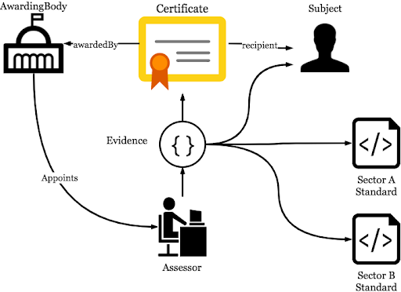

**Project inCredible**

[https://github.com/sunbird-specs/inCredible](https://github.com/sunbird-specs/inCredible)

## Electronic Credential Specification for Academic and Skilling Domain
### Technical Specification - Version 1.0


April 2019

**Table of Contents**
   * [Introduction](#introduction)
      * [Principles](#principles)
   * [Specification](#proposed-specifications)
      * [Conceptual Model](#conceptual-model)
      * [Data Modelling Principles](#data-modelling-principles)
      * [Visual Representation](#visual-representation)
         * [QR Codes](#qr-codes)
      * [Entity Identity](#entity-identity)
      * [Structural Model](#structural-model)
         * [Assertion](#assertion)
         * [Recipient](#recipient)
         * [BadgeClass](#badgeclass)
         * [AwardingBody](#awardingbody)
         * [Competency Standard](#competency-standard)
         * [Evidence](#evidence)
         * [Assessor](#assessor)
      * [Data Model](#data-model)
         * [Open Standards](#open-standards)
         * [Identifiers](#identifiers)
      * [Object Model](#object-model)
         * [Assertion](#assertion-1)
         * [CertificateExtension](#certificateextension)
         * [CompositeIdentity Object](#compositeidentity-object)
         * [BadgeClass](#badgeclass-1)
         * [Profile: AwardingBody/Assessor/Trainer](#profile-awardingbodyassessortrainer)
         * [Alignment Object](#alignment-object)
         * [Evidence](#evidence-1)
         * [TrainingEvidence](#trainingevidence)
         * [AssessedEvidence](#assessedevidence)
         * [Assessment](#assessment)
         * [Signatory Extension](#signatory-extension)
      * [Additional Properties](#additional-properties)
   * [List of Appendices](#list-of-appendices)
      * [Appendix 1: Signing Procedure for Assertions and Evidence](#appendix-1-signing-procedure-for-assertions-and-evidence)
      * [Appendix 2: Usage of credentials](#appendix-2-usage-of-credentials)
      * [Appendix 3: Verifying Authenticity of a Certificate](#appendix-3-verifying-authenticity-of-a-certificate)
      * [Appendix 4: List of extensions to OpenBadges v2.0](#appendix-4-list-of-extensions-to-openbadges-v2.0)
   * [References](#references)

# Introduction

The academic and skilling ecosystem is a complex arena with a number of frictions preventing an optimal supply and demand equilibrium, resulting in the inability to access learning and job opportunities. These frictions include low trust, information asymmetry, low ability to compare, costly verification procedures, and portability amongst many others. A core issue in academic ecosystem is the diificulty of students/teachers to easily apply and get their certificated verified in a electronic paperless manner. Similarly, in the jobs and skills arena, individuals face great difficulties in showcasing their skills and exchanging credentials in a trusted manner. 

This document proposes an electronic, machie readable specification to represent various credentials/certificates in both academic and skilling ecosystem across the ecosystem. An electronic standard for data representing credentials allows certificates to be awarded in a digital, machine-readable format. The standard enables an individual to easily transfer credentials in a trusted manner anywhere and thereby open up possibilities for applying to remote jobs.

Currently, except few implementations, most academic and skill certificates are paper-based and are not digitally verifiable. In contrast, digital credentials are freely portable and easily verifiable at scale and speed by employers and job matching platforms, whilst continuing to allow print and other visual forms for human consumption.

This document is an open specification, an extension based on OpenBadges V2, which can be incorporated into the certificate issuance systems of various academic instributions, skill training providers, apprenticeships, employers, testing agencies, or others in the ecosystem. 

## Terminology
1. _credential _and _credentials_ are used to mean a _qualification or achievement of a person or entity used to indicate their suitability for something_. A certificate or other form of attestation is typically issued to award and recognize such a qualification.
2. _issuer_ is synonymously used with awarding body to distinctly identify it as an entity, as the case may be in most cases.


```
NOTE: This specification is based on Open Badges 2.0 with necessary extensions.
```


## Principles

**Verifiability**: Authenticity of a credential should be digitally verifiable by any application to which it is presented. The credential verification must be possible even without the physical presence of the credential holder.

**Portability**: The credentials should be digitally portable across systems participating in the ecosystem. Usage of paper-based certificates are unrestricted; the holder can present the certificate to any party of her choice. This flexibility should be preserved. This includes copying to a digital storage under the control of credential holder, easy consented transfer cum sharing with other parties.

**Permanence**: The credentials should exist, be accessible and portable beyond the lifetime of the awarding institution. 

**Self Describing**: The credential model should be self-descriptive. Any person or entity who needs to understand and/or compare the credential with another equivalent one must be able to do so without any hindrance. All the data and context required to this understanding must be available and accessible in the credential itself, either directly as data or indirectly as references.

**Privacy Protection**: It is strongly advised that the agencies adopting this specification give paramount importance to the principles of privacy preservation including data protection and consented sharing.


# Specification

## Conceptual Model

A certificate captures a relationship between the following entities

*   Awarding body
*   Recipient
*   Domain
*   Standard(s) accomplished
*   Assessor
*   Evaluation
*   Time

The **awarding body** certifies that the **recipient** has **accomplished **specified** standard(s)** in a **domain** based on an **evaluation** conducted by the **assessor **at a** particular time**.

Note that a single certificate may be issued for the recipient's accomplishment of multiple standards.


<p align=”center”>



**Fig 1** The actors in the certificate ecosystem
</p>


## Data Modelling Principles


1. All entities in the certificate issuance transaction must be represented using machine-readable objects.
2. Each object in the data-model is a representation of an entity.
3. Assign strong identifiers to all entities where some other party might reasonably want say something about an entity or do something with the representation of the entity. The strong identifiers for the entities should never be altered.


## Visual Representation

A visual representation of the credential (rendering) can be generated using data from the JSON-LD representation and subsequently embedded into the JSON-LD object. Applications issuing credentials can apply business-specific rules for rendering certificates. In some contexts, it may be preferable to create multiple renderings -- the granularity of the details presented can be tuned according to the needs outlined by the use case.

Applications are also open to using format of choice when embedding the rendered certificate. Formats such as PDF documents or images are well-suited for long-term survivability and compatibility. PDF documents may also carry metadata inside them. Other formats such as HTML are attractive as they are easier to generate. One must note, however, that HTML standards evolve over time. To ensure that embedded HTML will render well twenty or thirty years in the future, a very minimal and high-compatibility subset of HTML should be used.


### QR Codes

Printable representations of the credential may also carry QR codes as an offline-to-online bridge. If a QR code is part of the printable representation then the QR code may contain credential metadata in its payload which aid in the verification of the credential. There are two broad means of verifying a credential, either by verifying the digital signature of a hosted representation or by verifying the digital signature offline.


1. If the credential is cloud-hosted,
    1. the QR code should contain the HTTP URI from where the signed JSON-LD document describing the credential can be retrieved.
    2. Once retrieved, this JSON-LD data may be passed to downstream digital systems for signature verification.
    3. It may also be stored offline for further sharing or for other needs including visual comparison against the printed credential.
2. If the credential is not hosted in the cloud,
    4. If the credential JSON document is small enough, the JSON payload may be encoded as a string and embedded into the QR code. To reduce the size of the JSON, the payload may be compressed using the GZIP compression algorithm.
    5. If the credential JSON document is larger than 2900 bytes, the QR code should contain essential information to verify the digital signature offline. The following items required for signature verification should be inserted into a JSON object. The entire JSON object then must be encoded as a string and embedded  into the QR code.
        a. <strong><code>id</code></strong>: @id of the document
        b. <strong><code>hash</code></strong>: hash of the document without the <strong><code>scd:signature</code></strong> element. The hash is recommended here for protecting any personal or sensitive data from accidental leakage, misuse.
        c. <strong><code>publicKey</code></strong>: HTTP URI of the key used to sign the credential
        d. <strong><code>signature</code></strong>: bytes of the digital signature generated using (a) and (b)


## Entity Identity

An important part of issuing credentials is to identify the entities involved in the process. To issue the credential a few different types of entities participate: institutions, individuals, documents and standards. Since a credential is a permanent document by nature which may be used and remain valid over a long period of time, two broad principles apply for all identifiers:


*   **Singularity**: An identifier should resolve to a single entity, for example a person or an institution are single entities.
*   **Permanence**: An identifier should not be reassigned to a different entity at a future point.

For example, a phone number is not a good means of identifying a person for the purpose of issuing a credential. A credential must be valid for many years, it may be presented for validation 10, 20 or even 50 years later. A person's phone number may change in the intervening time-period and the number given up by that person may be re-allocated to another different person. Hence an ID, such as a phone number, which does not provide the guarantee of resolving to the same person for the duration of use of the credential is not well-suited for identifying the recipient.

Conversely, a document such as a passport or a voter identity card (which will eventually expire) is a better candidate for identifying a person since the passport number or voter id number is not reused and will always continue to represent the same person over time.


## Structural Model

The structural model of a credential aligns with the OpenBadges v2.0 schema and adds extensions where necessary.

<p align=”center”>


**Fig 2**: The Credential Structural Model
</p>


### Assertion

An assertion is a statement of fact. The credentials issued are statements of fact about recipient's accomplishments. Hence, the root object of the credential is called an assertion. The assertion object is a container object for sub-objects representing the awarding body, recipient and the recipient's credentials being certified. The assertion object described in this specification extends the OpenBadges v2.0 <strong><code>Assertion</code></strong> object with a few additional properties via the <strong><code>CertificateExtension</code></strong> class.


### Recipient

The recipient of the certificate may be an individual or an organisation. The recipient of the certificate is identified by an <strong><code>IdentityObject.</code></strong>


### BadgeClass

The <strong><code>BadgeClass</code></strong> describes a category of credentials that is awarded. The badge class contains details of the awarding body of the credential, the academic/skill domain & standard achieved. For instance, one category of of credentials may be a School Leaving Certificate awarded by a school board, another could be a Bachelor's Degree certificate awarded by a University.


### AwardingBody

The awarding body of the credential will be an organisation or institution which is a competent authority to certify recipients. Note that the awarding body is different from the signatory (i.e. the individual(s) who applies his/her signature to the credential).


### Competency Standard

Standard is a academic/skill definition or a competency defined by a certified standards body for the domain. Any given standard must be uniquely identifiable and will also commonly be part of a framework which defines relationships between standards in a domain. <strong><code>BadgeClass</code></strong> descriptions link to defined standards via <strong><code>AlignmentObjects</code></strong>.


### Evidence

The credential may contain one more list items of evidence which have been assessed in support of the credential. Each item of evidence may contain an assessment performed by the assessor. The evidence may link to standards criteria and a level of mastery which the recipient displays for the given criterion.


### Assessor

The assessor evaluates a trainee's competencies. The assessor is an organisation or institution which has been certified as a competent authority to assess the capability/skill for a given domain standard(s).


## Data Model


### Open Standards

The credentials data model uses the following standards for defining a credential:


*   Alignment with OpenBadges v2.0 vocabulary for defining accomplishments. The OpenBadges vocabulary is extended in some areas for specific use cases.
*   RDF 1.1 is used as the means for expressing the data contained in a credential.
*   There are two serialization preferences given to the adopter of this specification:
    * For users who are new to JSON-LD, the convenient serialisation format could be JSON. In such cases, the JSON-LD contexts must be pre-determined by the adopter. The JSON-LD is necessary to support other consumers, such as verifiers, that may prefer use of JSON-LD over JSON. Use [HTTP link headers](https://www.w3.org/TR/json-ld11/#interpreting-json-as-json-ld) on how to refer to context document using JSON.
    * Advanced users can choose to serialize using JSON-LD, however, consumers of a credential are free to use alternative serialisation formats such as RDFs or a triple expression language such as Turtle.
*   The credentials model uses (and in some places extends) the vocabulary of Classes and Properties described by schema.org and the WebPayments specification.
*   Additionally the credentials model defines some new classes of objects.
*   Each object class used in the model must be defined in terms of an RDF schema. Under the JSON-LD serialisation format, the schema needs to be published and made available at a specific web URL for validation and consumption of credentials. 


### Identifiers

Based on the above principles for identifying entities using strong identifiers the following apply when assigning identifiers for objects.


*   Use URIs wherever possible for compatibility with web protocols
*   Since we represent data in JSON-LD, the preferred URI for an entity is a dereferenceable URL which points to the location where the entity's JSON-LD representation can be found
*   If a URL is unavailable, use a URN. The id must be created within a well-known namespace with an established namespace identifier (NID)
    *   URN: <strong><code>urn:{namespace-id}:{private-id}</code></strong>
*   If an established NID is unavailable to create a URN, the TAG URI scheme can be used when there is a web domain name for the creator of the ID.
    *   TAG:<strong><code> tag:{creator-domain},{domain-register-date}:{id-type}:{id}</code></strong>
*   Where URNs and TAGs cannot be derived, strong globally unique identifiers should be created via locally unique identifiers using <strong><code>IdentityObject </code></strong>where the <strong><code>@type</code></strong> is a namespace describing the type of identifier and the identity is the local ID.
    *   <strong><code>@type</code></strong> should be a string which contains two parts separated by a delimer, the first part must be a well-known id for the creator of the local identifier, the second part can be any string which describes the id


#### <strong>Identifier Namespaces</strong>

Below, we propose some informal namespaces for commonly used identifiers types. These namespaces can be used as the NID for URNs. The format used for NIDs is <strong><code>in.<domain>.<id-creator>.<id-type></code></strong>, where domains are .gov, .edu, .com & .org. This format can be used to construct new informal namespaces for NIDs.

Non-unique namespaces cannot be used as NIDs for URNs but may be utilised as the @type property for a component of a composite identity represented by an <strong><code>IdentityObject</code></strong>.

Following identifier types are used commonly in India.


<table>
  <tr>
   <td><strong>Identifier Type</strong>
   </td>
   <td><strong>Namespace</strong>
   </td>
   <td><strong>Example</strong>
   </td>
  </tr>
  <tr>
   <td>PAN
   </td>
   <td><strong><code>in.gov.itd.pan</code></strong>
   </td>
   <td><strong><code>urn:in.gov.itd.pan:ZZZZZ00000</code></strong>
   </td>
  </tr>
  <tr>
   <td>GSTN
   </td>
   <td><strong><code>in.gov.gstn.gstn</code></strong>
   </td>
   <td><strong><code>urn:in.gov.gstn.gstn:Z00000000000001</code></strong>
   </td>
  </tr>
  <tr>
   <td>Driver License (KA)
   </td>
   <td><strong><code>in.gov.ka-dot.dl</code></strong>
   </td>
   <td><strong><code>urn:in.gov.ka-dot.dl:ZAAAAAAAAAAAAB</code></strong>
   </td>
  </tr>
  <tr>
   <td>Driver License (MH)
   </td>
   <td><strong><code>in.gov.mh-dot.dl</code></strong>
   </td>
   <td><strong><code>urn:in.gov.mh-dot.dl:ZOOOOOOOOOOOAB</code></strong>
   </td>
  </tr>
  <tr>
   <td>Aadhaar
   </td>
   <td><strong><code>in.gov.uidai.aadhaar</code></strong>
   </td>
   <td><strong><code>urn:in.gov.uidai.aadhaar:11111111111</code></strong>
   </td>
  </tr>
  <tr>
   <td>Voter Identity
   </td>
   <td><strong><code>in.gov.eci.voterid</code></strong>
   </td>
   <td><strong><code>urn:in.gov.eci.voterid:X11111111X</code></strong>
   </td>
  </tr>
  <tr>
   <td>Passport
   </td>
   <td><strong><code>in.gov.mea.psprt</code></strong>
   </td>
   <td><strong><code>urn:in.gov.mea.psprt:XX99999999</code></strong>
   </td>
  </tr>
  <tr>
   <td>Roll Number
   </td>
   <td><strong><code>in.<dom>.<iss>.rollno</code></strong>
   </td>
   <td><strong><code>urn:in.gov.cbse.rollno:999999999</code></strong>
   </td>
  </tr>
  <tr>
   <td>Name
   </td>
   <td><strong><code>name</code></strong>
   </td>
   <td><strong><code>Ram Singh</code></strong>
   </td>
  </tr>
  <tr>
   <td>Date of Birth
   </td>
   <td><strong><code>dob</code></strong>
   </td>
   <td><strong><code>Date of birth in YYYY-MM-DD format</code></strong>
   </td>
  </tr>
  <tr>
   <td>Photo
   </td>
   <td><strong><code>photo</code></strong>
   </td>
   <td><strong><code>data:image/png;base64,<base64 encoded></code></strong>
   </td>
  </tr>
</table>


Table 1:  Informal namespaces for commonly used identifiers


#### **URN Identifiers**

URNs are URIs which follow the Universal Resource Name (URN) scheme. A URN consists of three parts separated by colons (:)

**urn        **:        **{nid}        **:        **{nss}**

**    **namespace id    namespace specific string

The namespace id (nid) defines the type of identifier. The consumer of a URN can make processing decisions based on the nid. The consumer could use the nid to determine how to resolve the namespace specific string to an entity. For instance, the isbn namespace is registered for ISBN book codes.

The namespace specific string (nss) is the value of the ID within the nid. Continuing the above example of books, the nss would be the ISBN of a specific book such as 8120351312.

Together, the combination of <strong><code>urn:isbn:8120351312</code></strong> forms a URN which uniquely identifies a book.


#### **Institution IDs**

Institutions are identified in two scenarios. The first of these is an institution is an awarding body of credentials or is an assessor of a subject (recipient). In this scenario, the institution should be identified using a URL which points to the institution's profile (in JSON-LD format). The profile must contain the awarding body/assessor properties defined in the model below. Additionally, the profile may also contain more information about the institution (e.g. rankings, institutional standards, authorisations etc) using the appropriate RDF schemas. The profile may also contain links to other tools where such information about the institution can be retrieved.

Second, as the recipient of credentials, institutions should also be identified using a URL which points to the institution's profile. The profile data may contain embedded objects detailing publicly available and well-known identifier types. The would be represented using the RDF <strong><code>sameAs</code></strong> property whose value is an <strong><code>IdentityObject</code></strong>. When using such identifiers the identity can be represented as a URN.


#### **Individual IDs**

Individuals are identified in two scenarios. First as recipients of credentials and second, as signatories to a credential. In both scenarios, the individuals should be identified by an <strong><code>IdentityObject </code></strong>which contains one or more identifying attributes. If the individual can be identified by a HTTP URL, the <strong><code>IdentityObject</code></strong> should be of <strong><code>@type: "url"</code></strong>. In case of an identity which is comprised of multiple parts, an <strong><code>IdentityObject</code></strong> of <strong><code>@type: "composite"</code></strong> should be used containing components which are in turn <strong><code>IdentityObjects</code></strong> of a variety of types.

Typically, an individual is identified by a combination of name, date of birth, gender and photo. Aside from this, other attributes like the name of a relative or a masked unique identifier may also be used. Agencies are encouraged to support the use of multiple modes of identity which may be available to recipients.

If using unique identifiers, agencies should evaluate privacy concerns which may stem from embedding a unique identifier into the credential. In such cases, a masked identifier may serve the purpose of identifying the individual without compromising privacy.


#### **Object Ids**

Machine-readable objects such as <strong><code>Assertions</code></strong>, <strong><code>BadgeClasses</code></strong> & <strong><code>Evidence</code></strong> should be identified for the purpose of validation and comparison.

**Assertions & Evidence**

Ideally, Assertions and Evidence should be identified via a UUID encoded as a URN.

Example: <strong><code>urn:uuid:ec58b28e-a6ab-49c2-a24d-ebefa02476cd</code></strong>

If use of a UUID is not feasible, for instance if documents are numbered serially, the TAG URI scheme should be used where a document id is prefixed with a namespace consisting of the document creator's domain name, its registration date and the document type.

Example:<strong><code> tag:exampleinstitute.org,2010-09:marksheet:9871624</code></strong>

**BadgeClass**

BadgeClasses should ideally be identified via a HTTP URL which returns a JSON-LD representation of the class. If the BadgeClass is defined for a single ad-hoc usage and is not published at a URL, a UUID encoded as a URN is recommended.  


## Object Model

Objects and the properties as defined by this credentials specification are detailed here.


### Assertion

The base of the model is an assertion. The assertion class is defined as part of the <strong><code>OpenBadges</code></strong> v2.0 specification. Some additional properties are added via <strong><code>CertificateExtension.</code></strong>


*   <strong><code>id </code></strong>which uniquely identifies the assertion. If assertions are verified by signing, a UUID should be used from the<strong><code> urn:uuid</code></strong> namespace. If hosted verification is used, the Id should be a HTTP URL containing the certificate data.
*   <strong><code>type </code></strong>An array containing the strings Assertion, Extension and <strong><code>extensions:CertificateExtension</code></strong>
*   <strong><code>issuedOn </code></strong>when the credential was awarded
*   <strong><code>recipient</code>(s) </strong>person(s) or organisation(s) who received the credential.
    *   If the certificate contains signed evidence, the subject of the evidence can be assigned a relative IRI as an @id and referenced as the recipient of the certificate.
        *   <strong><code>"recipient": {"@id": "#/evidence/0/subject"}</code></strong>
    *   If there are multiple recipients, the element should be a list of entities
*   <strong><code>badge</code></strong> an embedded BadgeClass object which describes the type of certificate being awarded or a HTTP URL which contains a machine-readable representation of a BadgeClass
*   optional <strong><code>image</code></strong> which is a HTTP URL to a <em>baked</em> PNG or SVG image
*   <strong><code>evidence</code> </strong>containing details of competencies assessed
*   optional <strong><code>expires</code></strong> containing the date the certificate ends validity
*   <strong><code>verification</code></strong> containing the string <strong><code>LinkedDataSignatures</code></strong> for signed certificates
*   <strong><code>narrative</code></strong> as text or markdown text which can be used to describe and connect multiple pieces of evidence

### CertificateExtension

The Assertion type from OpenBadges is extended by the <strong><code>CertificateExtension</code></strong> which adds the following field definitions.

*   optional <strong><code>awardedThrough</code></strong> service or program through which the credential is awarded (eg: PMKVY)
*   optional list of <strong><code>signatory</code></strong> who signed the certificate. This is of type IRI pointing to an <strong><code>SignatoryExtension</strong></code>.
*   <strong><code>printUri</code> </strong>a HTTP URL to a printable version of this certificate.
    *   The printable version of the certificate can be embedded into the machine-readable data using data URIs. The encoding scheme is: <strong><code>data:[mime-type][;base64],<base64-encoded-data></code></strong>
        *   A base64 encoded PDF document could be represented as a data URI: <strong><code>data:application/pdf;base64,<base64 encoded binary PDF></code></strong>
        *   A base64 encoded image document can be represented as a data URI: <strong><code>data:image/jpeg;base64,<base64 encoded binary JPG></code></strong>
    *   If there are multiple printable documents to be embedded, a list of URIs can be added.
*   optional <strong><code>validFrom</code> </strong>the date from which certificate is valid.
*   <strong><code>signature</code></strong> added by the awarding body using its private key.


### CompositeIdentity Object

OpenBadges v2.0 uses IdentityObjects to represent the recipient of a certificate. We extend it to represent a composite identity which is composed of a sub component <strong><code>IdentityObjects</code></strong>.

To facilitate composite identities, the specification introduces:

*   a new <strong><code>IdentityObject</code></strong> <strong><code>@type</code></strong> identifier called <strong><code>composite</code></strong>
*   a new property <strong><code>annotation</code></strong> which can be used to qualify the identity type
*   a new property <strong><code>components</code></strong> for composite identities. This property will contain sub-fields of the identity
*   a new optional property <strong><code>name</code></strong>

The fields of a <strong><code>CompositeIdentityObject</code></strong> will be

*   <strong><code>type</code></strong> will be Composite
*   <strong><code>hashed</code></strong> boolean flag whether the information is plain text or hashed. True if hashed.
*   <strong><code>identity</code></strong> will be omitted at this level, instead use it at component level.
*   <strong><code>components</code></strong> will be an array of other <strong><code>IdentityObjects</code></strong>

Additionally, we define the following <strong><code>IdentityObject</code></strong> <strong><code>type</code></strong> identifiers to extend the set of profile identifier properties defined by OpenBadges.

*  <strong><code>identity</code></strong> represents the value of the annotation, such as a father's or a spouse's name of the recipient.
*   optional <strong><code>photo</code></strong>: a photograph, either a HTTP URL for a image or a data URI containing the mime type and image data in base64 encoding.
*   optional <strong><code>dob</code></strong>: the date of birth in YYYY-MM-DD format.
*   optional <strong><code>gender</code></strong>: the gender of the individual. 
*   <strong><code>tag</code></strong>: a Tag URI. Required, if urn is specified.
*   <strong><code>urn</code></strong>: a Uniform Resource Name. Required, if url is provided.
*   <strong><code>url</code></strong>: a Universal Resource Location. Required, if urn is not provided.


### BadgeClass

*   <strong><code>id</code></strong> which uniquely identifies the <strong><code>BadgeClass</code></strong>
    *   If the credential is an instance of a larger category of certificates which may be awarded multiple times, it must be a HTTP URL where the JSON-LD description of the <strong><code>BadgeClass</code></strong> is available.
    *   If the certificate is ad-hoc or short-lived and unlikely to be awarded repeatedly, a <strong><code>urn:uuid</code></strong> class identifier can be used
*   <strong><code>type</code></strong> fixed string literal, <code>"BadgeClass"</code>
*   <strong><code>name</code></strong> The name of the credential represented by this <strong><code>BadgeClass</code></strong>
*   optional <strong><code>description</code></strong> A short text description of the credential
*   optional <strong><code>version</code></strong> describing the version of the <strong><code>BadgeClass</code></strong>, which can be updated as the credentials evolve over time.
*   optional <strong><code>image</code></strong> an image representing the credential, may be a HTTP URL where the image can be found or a data URI including mime-type
*   optional <strong><code>criteria</code></strong> an embedded object describing the criteria for achieving the credential or a HTTP URL of a JSON-LD object describing the criteria
*   <strong><code>issuer</code></strong> AwardingBody profile of person or organisation entity which awarded the credential. It is recommended that the complete JSON-LD object representing the awarding body is embedded into the BadgeClass. The set of fields to uniquely identify the awarding body and to verify the awarding body's signature on the credential <em>must</em> be embedded into the certificate. If the complete awarding body profile is not embedded into the BadgeClass, then the <strong><code>@id</code></strong> of the embedded object must be a HTTP URL from which a more complete JSON-LD object can be retrieved.
*   optional <strong><code>alignment</code></strong> which maps the <strong><code>BadgeClass</code></strong> to one or more academic standards.
*   optional <strong><code>related</code></strong> an object or list of objects relating this <strong><code>BadgeClass</code></strong> to other <strong><code>BadgeClasses</code></strong>.
    *   If the <strong><code>BadgeClass</code></strong> is part of a series, for instance if a new class is created for each batch or semester, this may be used to link to previous instances of the same class.
    *   This field may also be used to refer to the previous revision of <strong><code>BadgeClass</code></strong> or to alternate language editions of this <strong><code>BadgeClass</code></strong>
*   optional <strong><code>alignment</code></strong> containing details of alignment to educational standards. This could be a list.
*The fields in the BadgeClass are as-is from Open Badges 2.0 specification and have been included here for additional explanation.*

### Profile: Issuer/Assessor/Trainer


*   <strong><code>id</code> or<code> ID</code> </strong>to identify the awarding body. Should be a HTTP URL where a JSON-LD object describing the awarding body can be retrieved.
*   <strong><code>type</code></strong> will be the array <strong><code>Profile</code></strong> along with <strong><code>Extension</code></strong> and <strong><code>extensions:SignatoryExtension</code></strong> if the profile is for an entity which will be providing digital signatures.
*   <strong><code>name</code></strong> the name by which the awarding body is known
*   optional <strong><code>email</code></strong> containing the address where this awarding body can be reached
*   optional <strong><code>url</code></strong> pointing to a HTTP accessible profile page or homepage of the awarding body
*   optional <strong><code>description</code></strong> short text describing the issuing person or organisation
*   <strong><code>publicKey</code></strong> containing the public key of the awarding body/Assessor/Trainer which must be embedded inside the assertion if the credential is signed.
*   optional <strong><code>revocationList</code></strong> containing a HTTP URL of the list of signed badges awarded by this body which have been revoked

*The fields in the BadgeClass are as-is from Open Badges 2.0 specification and have been included here for additional explanation.*

### Alignment Object

The OpenBadges v2.0 <strong><code>AlignmentObject</code></strong> is used to link a <strong><code>BadgeClass</code></strong> or an item of <strong><code>Evidence</code></strong> to an academic standard.


*   <strong><code>targetName</code></strong> which identifies the name of target standard
*   <strong><code>targetURL</code></strong> a HTTP endpoint which uniquely identifies the standard where a description of the standard can be found. Ideally should be a JSON-LD object describing the standard.
*   <strong><code>targetFramework</code></strong> a string describing the name of the standards framework
*   <strong><code>targetCode</code></strong> a string containing a code within target framework for the aligned standard


### Evidence

The <strong><code>Evidence</code></strong> class from OpenBadges v2.0 spec is used to describe evidence in support of a credential.

*   <strong><code>id </code></strong>which uniquely identifies the evidence from the <strong><code>urn:uuid</code></strong> namespace or a HTTP URL of a webpage which presents the evidence
*   <strong><code>type</code></strong> containing the string Evidence. Additional types Extension and <strong><code>AssessedEvidence</code></strong> will be added when using <strong><code>AssessedEvidence</code></strong>
*   optional textual <strong><code>narrative</code></strong> which describes the evidence
*   optional text <strong><code>name</code></strong> of the evidence
*   optional longer text <strong><code>description</code></strong> of the evidence
*   optional text <strong><code>genre</code></strong> which describes the type of evidence, such as Certificate, Painting, Artefact, Medal, Video, Image. May be omitted in favour of the <strong><code>assessment</code></strong> property in the context of <strong><code>AssessedEvidence</code></strong>
*   optional text <strong><code>audience</code></strong> detailing the audience for which the evidence is presented


### TrainingEvidence

The <strong><code>TrainingEvidence</code></strong> class is an extension of <strong><code>Evidence</code></strong> class to add training specific properties.


*   <strong><code>type</code></strong> should an array containing <strong><code>Evidence,</code></strong> <strong><code>Extension</code></strong>, <strong><code>extensions:TrainingEvidence</code></strong>
*   <strong><code>subject</code></strong> the subject(s) of the evidence
*   <strong><code>trainedBy</code></strong>HTTP URL identifier to a JSON-LD object or an embedded profile of the person or organisation entity(s) which provided training to the recipient of the credential. The <strong><code>@id</code></strong> of the profile should either be a URI which uniquely identifies the training entity or should be a HTTP URL from which a more complete JSON-LD object can be retrieved
*   optional <strong><code>duration</code></strong> containing <strong><code>startDate</code></strong> and <strong><code>endDate</code></strong> specifying the duration of the course
*   optional <strong><code>session</code></strong> a string denoting a session or a batch of the course that the recipient completed


### AssessedEvidence

The <strong><code>AssessedEvidence</code></strong> class is an extension to the <strong><code>Evidence</code></strong> class which adds additional fields for assessors and signatures.


*   <strong><code>type</code></strong> should an array containing <strong><code>Evidence, Extension</code></strong>, <strong><code>extensions:AssessedEvidence</code></strong>
*   <strong><code>subject</code>(s)</strong> the subject(s) of the evidence
*   <strong><code>assessment</code></strong> conducted which elicited the evidence
*   <strong><code>assessedBy</code> </strong>HTTP URL identifier to a JSON-LD object or an embedded profile of the individual(s) or organisation(s) who assessed the competency. The <strong><code>id</code></strong> of the profile should either be a URI which uniquely identifies the training entity or should be a HTTP URL from which a more complete JSON-LD object can be retrieved
*   <strong><code>assessedOn</code> </strong>the date when the assessment was conducted
*   optional <strong><code>signature</code></strong> of the assessor(s)

If assessors are not ready and able to submit individually signed evidence, the assessor's signature on the <strong><code>AssessedEvidence</code></strong> may be omitted. It is then the responsibility of the awarding body to ensure the authenticity of the evidence submitted by the assessor through other available channels. Over time, migrating the assessment ecosystem to standardise on individually signed items of evidence will increase the overall level of trust in the certification process and will increase the utility of certificates in the employment process.


### Assessment

<strong><code>Assessments</code></strong> can vary based on the nature of the assessment carried out. The essential fields of an assessment are


*   <strong><code>type</code></strong> of the assessment will be <strong><code>marks</code></strong>, <strong><code>percentage</code></strong>, <strong><code>grade</code></strong>, <strong><code>rank</code></strong> or some other means of assessing the subject
*   <strong><code>value</code></strong> of the assessment based on the type indicated.

Specific types of assessments may add additional properties to the Assessment object. Each new property must be published via JSON-LD documents which describe the schema and means of validation for the property.


#### **MarksAssessment**

To illustrate, a _schema for a marks-based assessment_ which adds additional properties to the Assessment schema is described:


*   <strong><code>minValue</code> </strong>The minimum score which must be achieved
*   <strong><code>maxValue</code></strong> The maximum score which could be achieved
*   <strong><code>passValue</code></strong> The actual passing score


### Signatory Extension

<strong><code>SignatoryExtension</code></strong> class extends the OpenBadges v2.0 <strong><code>IdentityObject</code></strong> to add the following properties:


*   optional <strong><code>designation</code></strong> of the signatory
*   optional <strong><code>image</code></strong> containing a HTTP URL or a data URI for an image associated with the signatory
*   optional <strong><code>publicKey</code></strong> object containing the public key of the signatory as defined by the LinkedDataSignatures specification. Required if the signatory will affix their digital signature to the credential.


## Additional Properties

Since the objects are modeled using RDF principles, additional properties may be added to the objects without affecting consumers. All properties and metadata not defined here which are used as extensions to the credential specification must follow or be compatible with available metadata standards.


*   All consumers of credential data must be able to accept objects containing additional properties beyond the ones described as part of the credentials standard. They may choose to ignore, but the mere presence of additional properties does not break any integration.
*   RDF properties define a set of classes which are in the domain of a property. When adding a new property to an object, the appropriate domain class must be included in the** <code>@type</code></strong> array.


# List of Appendices
## Appendix 1: Signing Procedure for Assertions and Evidence
Signing a certificate is a process by which a one-way digest of the assertion object is computed and is then cryptographically signed (encryption) using the awarding body’s private key. The signature suite used will specify the digest and the cryptographic functions which are to be applied (suggestion is to use LinkedDataSignature2015).
The private key used for signing must be maintained in a secure repository and should be transferred only via secure channels. During application usage the keys should be maintained in the secure area such as an HSM. The data to be signed using the private key should be sent for signing and the signed value returned.


## Appendix 2: Usage of credentials

### Delivery and Storage of Credentials

Delivery mechanisms for credential documents can vary based on the context where they are awarded. A certificate for an online course may be awarded immediately in the browser, while an offline course with written exams may have an alternate method to deliver certificates. Furthermore, these mechanisms are dynamic and change over time. New modes of delivery may be developed and present methods may become obsolete. Similar considerations apply to the means of storing the certificate; the recipient may choose from multiple options available for securely storing the digital document.

To empower recipients with a choice of delivery and storage mechanisms and to ensure compatibility with future methods, delivery and storage is independent of the data in the credential. Thus the adopters may freely choose any means to identify the recipient of the credential and independently choose the way it is delivered and stored. Below we consider some well-established delivery and storage options as well as a few emerging technology options such as Blockcerts and uPort.


#### Email

One mode of delivery may be email. If the recipient's email address is known, and the recipient elects for email delivery, the certificate can be sent to the recipient's email address as an attachment. The recipient is then free to store using any solution available such as a cloud drive, offline storage etc.


#### Web

An alternate mode of delivery can be via a private URL which allows the recipient to download the JSON-LD credential. The recipient is then free to store using any solution available such as a cloud drive, thumb drive, offline storage etc. The private URL can be sent to the recipient via an SMS message to a mobile device, an email or any other communication channel available to the awarding body and the recipient.


#### DigiLocker and other National Repositories

Certificates can be stored in the cloud using services such as India's DigiLocker or any other National Academic Repositories. The machine-readable format has a printable representation embedded in it which can be used by client applications to render previews of the credential.


#### Blockchain

Blockchain applications may also be used to deliver the certificate to the recipient. The awarding body can use a blockchain certificate publishing protocol such as Blockcerts which is also compatible with OpenBadges to store certificates on a blockchain as part of transaction metadata. Recipients can then retrieve the certificate from the blockchain and store as per their choice.


#### Wallet

Application developers can create mobile wallets for storing credentials. The JSON-LD document containing the certificate can be imported into any number of such applications to manage accomplishments and credentials. The embedded printable representation may be used by wallet applications to render previews of the credential.


#### uPort

uPort is a toolkit for building distributed applications on top of the Ethereum blockchain. uPort applications can issue credentials to a user which are then attached to the user's profile. The certificate spec described above can be linked into a uPort message which is transported a JSON Web Token (JWT). The JWT contains signed-data as a <strong><code>claim</code></strong> which can be the assertion JSON object.


## Appendix 3: Verifying Authenticity of a Certificate

A certificate is authenticated along three dimensions.

First, verify that the certificate has been awarded by the awarding body.


1. The certificate contains one or more signatures in the signature field. The signature should be encrypted using the awarding body's private key.
2. Decrypt the signature using the awarding body's public key which returns the digest of the message.
    1. The awarding body's public key details are available in <strong><code>badge.awardedBy.publicKey</code></strong>
3. The digest of the message is computed and compared with the decrypted digest.  
4. If the two digests match, the signature is verified.
5. The specifics of the signature verification algorithm are described at:[ https://w3c-dvcg.github.io/ld-signatures/#signature-verification-algorithm](https://w3c-dvcg.github.io/ld-signatures/#signature-verification-algorithm)

Second, verify that the certificate is optionally digitally signed by the signatory


1. The certificate may also contain the signatory's digital signature in the signature field. The signature is encrypted using the signatory's private key.
2. The signature can be verified as above using <strong><code>assertion.signatory.publicKey</code></strong>

Finally, if the certificate contains signed evidence, verify the assessor's signature in each item of evidence in certificate.


1. The credential contains one or more items of evidence which contain signatures in the <strong><code>evidence.signature</code></strong> field encrypted using the assessor's private key.
2. The signature can be verified as above using the assessor's public key available from <strong><code>evidence.assessedBy.publicKey</code></strong>
3. The subject of the evidence must be the same as the recipient of the certificate.

Note that when authenticating the physical certificate, downloading the machine readable version from the URL contained in it's QR code is a first step. If the URL resolution fails, it cannot be assumed that the certificate is invalid, the URL may be unavailable for many reasons. In this scenario, the authenticity of the physical certificate must be verified via other means.


#### **Key Management**

Public keys for the awarding bodies could be cloud-hosted by each signing body. For instance, each Sector Skill Council (SSC) could maintain its own public keys in the cloud where they can be accessed by anyone trying to verify a certificate awarded by the SSC. However, if signing keys are cloud-hosted and the cloud location is embedded inside the certificate then any change in the location of the key will invalidate certificates. Awarding bodies may or may not be able to maintain a permanent location for their keys metadata. This could be worked around by either employing a key broker service which enables keys to be discovered after an awarding body has changed its location or alternatively by a capable entity providing a secure repository of public keys for all awarding bodies as an ecosystem service.

## Appendix 4: List of extensions to OpenBadges v2.0
### Context
In the JSON-LD [context file](./context.json), the "scd:" prefix denotes classes proposed as part of this specification.
1. All types which are added in addition to OpenBadges have been prefixed with "scd:"
2. All properties which were added as part of inCredible have also been prefixed with "scd:" 
3. The properties & types which are part of OpenBadges are prefixed with ob:, schema:, sec: or wid:

### Details
1. scd:CertificateExtension
This class was added as an extension to the <strong><code>Assertion</strong></code> class. New properties listed below, but not limited to, were added:
a. Digital Signature of awarding body
b. Signatory
c. Print URI which encapsulates the printable representation of the document as a URL or as embedded data
d. Validity starting date (end date was already in Open Badges)

2. scd:CompositeIdentity
This class extends the <strong><code>Identity</strong></code>. The OpenBadges spec allows us to represent the identity of the recipient via a hashed or unhashed email. However, in some cases, it could be useful to represent the identity as a combination of properties and thus the need of this class. 

3. scd:AssessedEvidence
This class was added as an extension to the <strong><code>Evidence</strong></code> class. By having this type, we could create a structure for how assessment related data would be captured in the credential. 

4. scd:TrainingEvidence
This class was also added as an extension to the <strong><code>Evidence</strong></code> type to support cases where the trainer and assessor are different.

In addition to the above, the following too have been added:
5. scd:SignatoryExtension
6. scd:Assessment


# References


1. Project inCredible -[ https://github.com/sunbird-specs/inCredible](https://github.com/sunbird-specs/inCredible)
2. OpenBadges v2.0:[ https://www.imsglobal.org/sites/default/files/Badges/OBv2p0Final/](https://www.imsglobal.org/sites/default/files/Badges/OBv2p0Final/index.html)
    1. examples:[ https://www.imsglobal.org/sites/default/files/Badges/OBv2p0Final/examples/](https://www.imsglobal.org/sites/default/files/Badges/OBv2p0Final/examples/)
3. JSON-LD Syntax:[ https://w3c.github.io/json-ld-syntax/#introduction](https://w3c.github.io/json-ld-syntax/#introduction)
4. JSON-LD:[ https://www.w3.org/TR/json-ld/](https://www.w3.org/TR/json-ld/)
5. RDF:[ https://www.w3.org/RDF/](https://www.w3.org/RDF/)
6. RDF Schema:  [https://www.w3.org/TR/rdf-schema](https://www.w3.org/TR/rdf-schema)
7. RDFa:[ https://www.w3.org/TR/rdfa-primer/](https://www.w3.org/TR/rdfa-primer/)
8. Turtle:[ https://www.w3.org/TR/turtle/](https://www.w3.org/TR/turtle/)
9. Uniform Resource Names:[ https://tools.ietf.org/html/rfc8141](https://tools.ietf.org/html/rfc8141)
10. The Tag URI scheme:[ https://tools.ietf.org/html/rfc4151](https://tools.ietf.org/html/rfc4151)
11. Schema.org Full Vocabulary:[ https://schema.org/docs/full.html](https://schema.org/docs/full.html)
12. Use of '@id' vs 'identifier':[ https://schema.org/docs/datamodel.html#identifierBg](https://schema.org/docs/datamodel.html#identifierBg)
13. Linked Data Signatures:[ https://w3c-dvcg.github.io/ld-signatures/](https://w3c-dvcg.github.io/ld-signatures/)
14. Rsa Signature Suite 2018:[ https://w3c-dvcg.github.io/lds-rsa2018/](https://w3c-dvcg.github.io/lds-rsa2018/)
15. Digilocker:[ https://digilocker.gov.in/](https://digilocker.gov.in/)
16. National Academic Depository:[ http://nad.gov.in/](http://nad.gov.in/)
17. Blockcerts:[ https://www.blockcerts.org](https://www.blockcerts.org)
18. uPort application development kit:[ https://www.uport.me/](https://www.uport.me/)
19. Linked Data Platform:[ https://www.w3.org/TR/ldp/](https://www.w3.org/TR/ldp/)
20. Architecture of the Web:[ https://www.w3.org/TR/webarch](https://www.w3.org/TR/webarch)
21. Web Payments Vocabulary: [https://web-payments.org/vocabs/security](https://web-payments.org/vocabs/security)
22. Interpreting JSON as JSON-LD: [https://www.w3.org/TR/json-ld11/#interpreting-json-as-json-ld] (https://www.w3.org/TR/json-ld11/#interpreting-json-as-json-ld)
